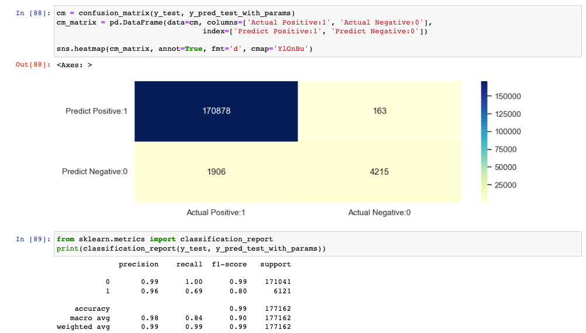

### Fraud Detection

**Sunil Kalyanpur**

#### Executive summary

#### Rationale
In an interconnected world, where technology continues to evolve rapidly, the threat of fraud has become ever more pervasive and sophisticated. Whether in finance, commerce, or digital interactions, the potential consequences of fraudulent activities can be devastating, impacting individuals, businesses, and society.

Anomaly detection identifies patterns or data points that deviate significantly from a dataset's norm or expected behavior. These anomalies are often referred to as outliers, and they can represent either rare events or suspicious activities, such as fraudulent transactions, in the case of fraud detection.

#### Research Question
The data comes from Vesta's real-world e-commerce transactions and contains a wide range of features from device type to product features. For each TransactionID in the test set, one must predict a probability for the isFraud variable

#### Data Sources
I plan to use Fraud detection datasets, specifically on Credit card frauds made available on Kaggle from Vesta https://www.kaggle.com/competitions/ieee-fraud-detection/data.

This dataset has 590540 rows and 394 columns (features).I aim to build a model that can be used as guidance on whether a transaction is a fraud.

#### Methodology
Below is the general outline of methods I plan to use:

* Data Collection and Preprocessing:
    * The data come from Vesta's real-world e-commerce transactions and contains a wide range of features from device type to product features. For each TransactionID in the test set, one must predict a probability for the isFraud variable. 
    * Preprocess the data to handle missing values, outliers, and standardize the format for consistency.
* Feature Engineering:
    * Create meaningful features that capture relevant patterns in the data.
* Supervised Learning Algorithms:
    * Since fraud detection is a supervised learning problem, I plan to use various classification algorithms, such as:
        * Logistic Regression
        * Decision Trees
        * Random Forests
        * Gradient Boosting Machines (e.g., XGBoost or LightGBM)
* Model Evaluation and Metrics:
    * Plan to use appropriate evaluation metrics such as precision, recall, F1-score, and area under the ROC curve (AUC-ROC) to measure the performance of the model.
    * Pay special attention to the trade-off between false positives and false negatives.
* Handling Imbalanced Data:
    * Fraud dataset is imbalanced, with a significantly lower number of fraud cases compared to non-fraud cases. Plan to use below techniques to handle include:
        * Oversampling the minority class (fraud) or under sampling the majority class (non-fraud).
        * Using Synthetic Minority Over-Sampling Technique (SMOTE) to create synthetic fraud cases.

#### Results
* As expected, dataset is highly imbalanced.
    * Total datapoints: 590540
    * Total Fraud datapoints: 20663
    * Total Fraud outliers datapoints (3 times the mean of TransactionAmt): 541
    * total Fraud outlier percent: 2.62
* It can be noted that the fraud occurred most in the credit category
* Fraudulent activities in cards
    * It can be noted that the fraud occurred most in the credit category
    * Discover card has more fraudulent transactions.
* ProductCD
    * W, C, R are the most frequent values
    * W, H, and R have more distribution of Fraud datasets compared to non-Fraud datasets
* Looks like day of week and hour of week are the powerful features to include to build models
* 

#### Feature Engineering
* Performed feature engineering using
    * TransactionAmt and card info - created new features for mean, standard Deviation
      * TransactionAmt_to_mean_card1
      * TransactionAmt_to_mean_card4
      * TransactionAmt_to_std_card4
      * id_02_to_mean_card1
      * id_02_to_mean_card4
      * id_02_to_std_card1
      * id_02_to_std_card4
      * D15_to_mean_card1
      * D15_to_mean_card4
      * D15_to_std_card4
      * D15_to_mean_addr1
      * D15_to_mean_addr2
      * D15_to_std_addr2
### Models
* Made use of lightgbm
  * 

#### Outline of project

- [Link to notebook 1](Fraud%20Detection-EDA%20and%20Model.ipynb)

##### Contact and Further Information
Note: 
* Dataset is not checkin because of GitHub filesize restrictions.
* To run Python notebook on local machine, download the data from kaggle from [here](https://www.kaggle.com/competitions/ieee-fraud-detection/data) and place the files at this level.
